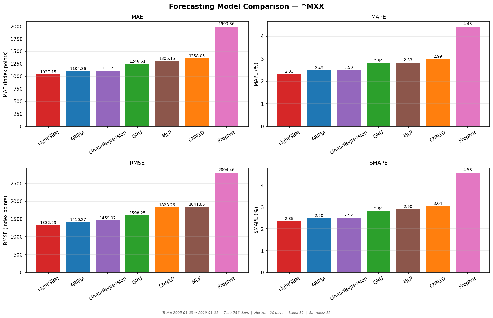
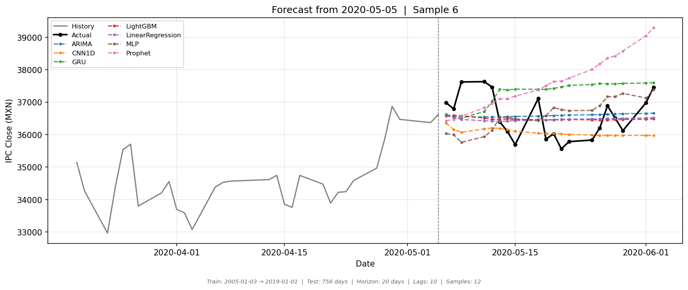
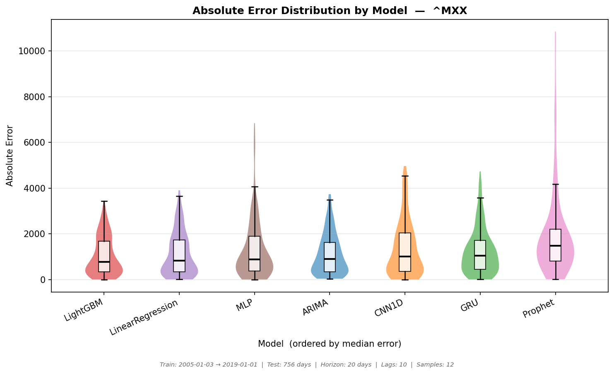
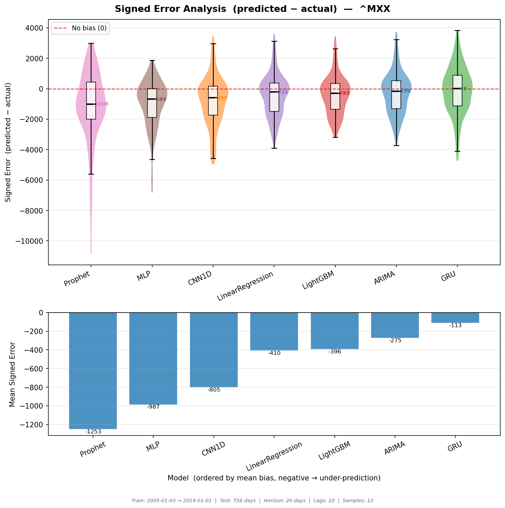
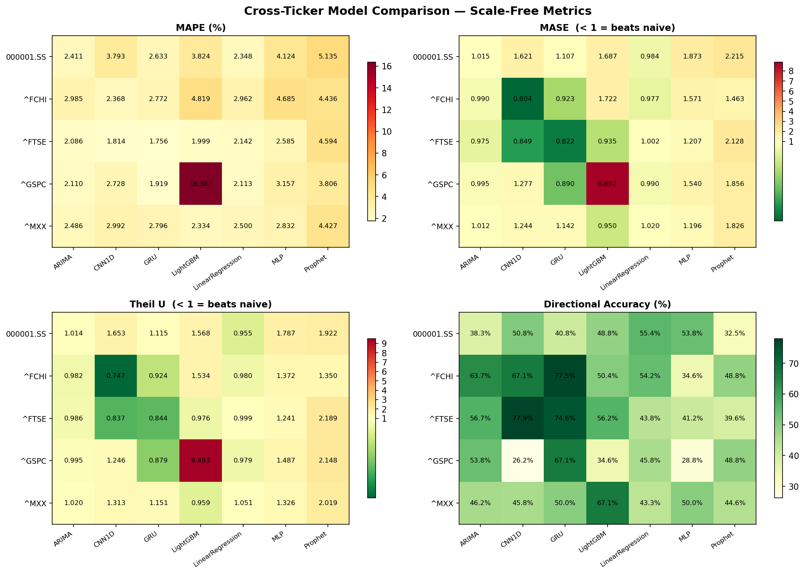

# QuantLab Arena

A modular Python framework for benchmarking classical, machine learning, and deep learning forecasting models on financial index time series. Evaluate 8 models side-by-side with a configurable train/test split, sequential sampling, and scale-free metrics that make results comparable across different indices.

---

## Motivation

A recurring issue in financial forecasting research is that studies tend to compare only ML or deep learning models among themselves, leaving out classical statistical baselines (ARIMA, Prophet) and — critically — the **naive random-walk baseline**. Without a naive benchmark it is impossible to know whether a sophisticated model is actually adding value, or simply tracking the autocorrelation structure of prices.

A second issue is **overfitting to a single evaluation context**: the best model varies with the index, the market regime, and the evaluation period. A model that dominates during a calm low-volatility year may rank last during a high-volatility crisis period. QuantLab Arena is designed to let practitioners quickly reproduce these comparisons on any Yahoo Finance symbol, any date range, and any forecast horizon — making it easy to stress-test model rankings across different conditions.

A third consideration is the **practical gap between theoretical and empirical neural-network performance**. While deep learning models are often expected to outperform classical approaches, this advantage is not guaranteed in financial forecasting. Neural networks require careful hyperparameter tuning (architecture, learning rate, regularisation) and sufficient training data to generalise well. In practice, when historical data is limited or the series is highly non-stationary, classical models such as ARIMA or even linear regression can match or outperform more complex architectures. QuantLab Arena makes this easy to verify empirically rather than assume.

This benchmark extends the empirical study presented in:

> G. Lorenzo-Landa and C. Minutti-Martinez, "Forecasting an Emerging Market Stock Index: a Comparative Study of Classical and Deep Learning Models," *2025 13th International Conference in Software Engineering Research and Innovation (CONISOFT)*, 2025, pp. 332–341. DOI: [10.1109/CONISOFT66928.2025.00049](https://doi.org/10.1109/CONISOFT66928.2025.00049)

That paper focused on the Mexican IPC index with a smaller set of comparisons. QuantLab Arena generalises the framework to multiple indices, adds scale-free metrics (MASE, Theil's U, Directional Accuracy), and includes Chronos as a zero-shot foundation-model baseline.

---

## Citation

If you use QuantLab Arena in academic work, please cite both this benchmark and the originating paper:

```bibtex
@software{quantlab_arena,
  author  = {Minutti-Martinez, Carlos and Lorenzo-Landa, Genoveva},
  title   = {{QuantLab Arena}: A Financial Time Series Forecasting Benchmark},
  year    = {2025},
  url     = {https://github.com/cminuttim/quantlab-arena}
}

@inproceedings{11369761,
  author    = {Lorenzo-Landa, Genoveva and Minutti-Martinez, Carlos},
  booktitle = {2025 13th International Conference in Software Engineering Research and Innovation (CONISOFT)},
  title     = {Forecasting an Emerging Market Stock Index: a Comparative Study of Classical and Deep Learning Models},
  year      = {2025},
  pages     = {332--341},
  doi       = {10.1109/CONISOFT66928.2025.00049}
}
```

---

## Features

- **8 models** from ARIMA to pretrained neural networks (Chronos)
- **Scale-free metrics** (MASE, Theil's U, Directional Accuracy) for cross-ticker comparison
- **Configurable evaluation**: cutoff date, test period length, forecast horizon, lag window
- **Automatic data download and caching** via yfinance — smart cache reuse across runs
- **Per-ticker output** organized in subdirectories; combined heatmap generated automatically when ≥ 2 tickers are available
- **Rich visualizations**: metric bar charts, violin/box error distributions, signed-error bias analysis, per-sample forecast overlays

---

## Models

| ID | Model | Type | Library |
|----|-------|------|---------|
| `arima` | ARIMA (auto order selection) | Statistical | pmdarima |
| `linreg` | Linear Regression | Classical ML | scikit-learn |
| `lgbm` | Gradient Boosting | Ensemble ML | LightGBM |
| `mlp` | Multilayer Perceptron | Neural Network | scikit-learn |
| `cnn` | 1D Convolutional Network | Deep Learning | PyTorch |
| `gru` | Gated Recurrent Unit | Deep Learning | PyTorch |
| `prophet` | Trend + Seasonality decomposition | Statistical | Prophet |
| `chronos` | Pretrained zero-shot forecaster | Foundation Model | Amazon Chronos T5 |

All ML and DL models use lag features of the closing price plus calendar features (day-of-week, month). Prediction over the horizon is done recursively (one step at a time, feeding predictions back as inputs).

---

## Installation

**Requirements**: Python 3.10+, PyTorch (CPU or CUDA), Prophet (requires Stan).

```bash
git clone https://github.com/cminuttim/quantlab-arena.git
cd quantlab-arena
pip install -r requirements.txt
```

For Amazon Chronos (optional, ~600 MB model download on first run):
```bash
pip install chronos-forecasting
```

> Prophet requires a working Stan installation. On most systems `pip install prophet` is sufficient. See [Prophet docs](https://facebook.github.io/prophet/docs/installation.html) if you encounter issues.

---

## Quick Start

```bash
# Run all models on the Mexican IPC index (^MXX), 2022 as test year
python main.py --cutoff-date 2022-01-01

# Skip Chronos for a faster first run
python main.py --cutoff-date 2022-01-01 --skip-chronos

# Quick smoke test: 3 samples, 3 models, 3 months of test data
python main.py --n-samples 3 --test-days 60 --models linreg arima lgbm --skip-chronos
```

---

## Usage

```
python main.py [options]

Data
  --ticker          Yahoo Finance symbol (default: ^MXX)
                    Examples: ^GSPC, ^FTSE, ^FCHI, 000001.SS, SPY, AAPL, BTC-USD
  --start-date      Start of training history, YYYY-MM-DD (default: earliest available)
  --cutoff-date     Train/test split date, YYYY-MM-DD (default: 2022-01-01)
  --test-days       Trading days in the test period (default: 252 ≈ 1 year)

Evaluation
  --n-samples       Forecast origins sampled from the test period (default: 12)
  --horizon         Forecast horizon in trading days (default: 10 ≈ 2 weeks)
  --lags            Lag window size for ML/DL models (default: 20)

Models
  --models          Space-separated subset: arima linreg lgbm mlp cnn gru prophet chronos
  --skip-chronos    Exclude Chronos (avoids the 600 MB download / slow CPU inference)

Output
  --output-dir      Base output directory (default: results/)
  --cache-dir       Data cache directory (default: cache/)
```

### Examples

```bash
# S&P 500 with a 2-year training window and 6-month test period
python main.py --ticker ^GSPC --start-date 2020-01-01 --cutoff-date 2023-01-01 --test-days 126

# Compare classical models only with more samples
python main.py --models arima linreg prophet --n-samples 20 --cutoff-date 2021-01-01

# Extended horizon: 1 month (21 trading days)
python main.py --horizon 21 --cutoff-date 2022-01-01 --skip-chronos

# Multi-ticker run — heatmap is generated automatically after the second ticker
python main.py --ticker ^MXX  --cutoff-date 2021-01-01 --n-samples 12 --skip-chronos
python main.py --ticker ^GSPC --cutoff-date 2021-01-01 --n-samples 12 --skip-chronos
python main.py --ticker ^FTSE --cutoff-date 2021-01-01 --n-samples 12 --skip-chronos
python main.py --ticker ^FCHI --cutoff-date 2021-01-01 --n-samples 12 --skip-chronos
```

---

## Output Structure

```
results/
├── all_metrics.csv                  # Combined metrics across all tickers (auto-generated)
├── ticker_comparison_heatmap.png    # Cross-ticker heatmap (appears with ≥ 2 tickers)
└── {TICKER}/
    ├── metrics_summary.csv          # Per-model metrics for this ticker/run
    ├── predictions.csv              # Full prediction detail (origin, step, model, pred, actual)
    └── plots/
        ├── comparison_metrics.png   # Bar charts: MAE, MAPE, RMSE, SMAPE
        ├── error_distribution.png   # Violin + box of absolute error per model
        ├── signed_error.png         # Bias analysis: signed error distribution + mean bias
        └── predictions_sample_NN.png  # Forecast overlay vs actual, one per sampled origin
```

---

## Metrics

### Scale-dependent (not cross-ticker comparable)

| Metric | Formula |
|--------|---------|
| **MAE** | Mean absolute error |
| **RMSE** | Root mean squared error |

### Scale-free (comparable across any ticker)

| Metric | Formula | Interpretation |
|--------|---------|----------------|
| **MAPE** | `mean(\|pred − actual\| / \|actual\|) × 100` | % error; lower is better |
| **SMAPE** | `mean(2\|pred − actual\| / (\|actual\| + \|pred\|)) × 100` | Symmetric %; lower is better |
| **MASE** | `MAE_model / MAE_naive` | < 1 beats the random walk; > 1 is worse |
| **Theil's U** | `RMSE_model / RMSE_naive` | Same as MASE but RMSE-based |
| **DirAcc** | `% steps with correct direction` | 50% = random; higher is better |

**Naive baseline** = last observed price repeated for all horizon steps (random walk). This is the natural benchmark for financial series.

---

## Sample Results

### ^MXX — Metric Comparison (2022 test year, horizon = 10 days)



### Forecast Sample — Origin 2022-07



### Error Distribution by Model



### Signed Error — Bias Analysis

Models above zero systematically **over-predict**; models below zero systematically **under-predict**.



### Cross-Ticker Comparison (^MXX, ^GSPC, ^FTSE, ^FCHI, 000001.SS)

MASE and Theil's U are centered at 1.0 — green cells beat the random walk, red cells do not.



---

## Benchmark Results

Results for 5 indices, cutoff 2021-01-01, test 252 days, horizon 10, samples 12, lags 60.
Scale-free metrics only (MAPE % and MASE).

| Ticker | Index | Best model (MASE) | MASE | MAPE |
|--------|-------|-------------------|------|------|
| ^FTSE | FTSE 100 | GRU | 0.822 | 1.76% |
| ^FCHI | CAC 40 | CNN1D | 0.804 | 2.37% |
| ^GSPC | S&P 500 | GRU | 0.890 | 1.92% |
| 000001.SS | Shanghai Comp. | LinearReg | 0.984 | 2.35% |
| ^MXX | IPC Mexico | LightGBM | 0.950 | 2.33% |

> **Note on Prophet**: Prophet is designed for weekly/monthly series with clear seasonality. For 10-day financial forecasting it consistently underperforms time series models. This is expected behavior, not a bug.

> **Note on LightGBM / ^GSPC**: Tree-based models can occasionally produce extreme errors due to their lack of extrapolation outside the training distribution. Results should be interpreted with this in mind.

---

## Ticker Reference

A full list of global index tickers compatible with Yahoo Finance is included in [`tickers.txt`](tickers.txt).

```
^GSPC   S&P 500 (USA)
^DJI    Dow Jones (USA)
^IXIC   Nasdaq Composite (USA)
^FTSE   FTSE 100 (UK)
^GDAXI  DAX 40 (Germany)
^FCHI   CAC 40 (France)
^N225   Nikkei 225 (Japan)
^HSI    Hang Seng (Hong Kong)
000001.SS  Shanghai Composite (China)
^MXX    IPC Mexico
^BVSP   Bovespa (Brazil)
BTC-USD Bitcoin / USD
```

---

## Project Structure

```
quantlab-arena/
├── main.py         # CLI entry point and orchestration
├── data.py         # yfinance download, smart cache, train/test split
├── features.py     # Lag features, calendar features, CNN/GRU sequence datasets
├── models.py       # BaseModel interface + 8 model wrappers
├── evaluate.py     # Evaluation loop and metric computation
├── visualize.py    # All plotting functions
├── requirements.txt
├── tickers.txt     # Yahoo Finance ticker reference
└── docs/
    └── images/     # Sample output plots used in this README
```

---

## License

MIT
